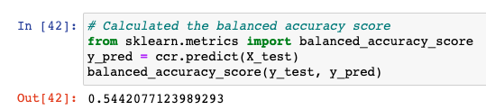
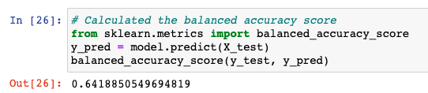
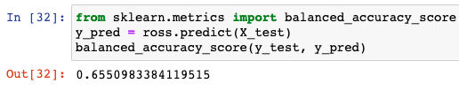
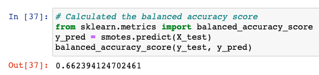
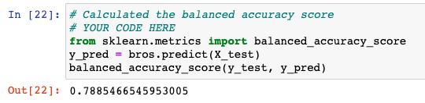
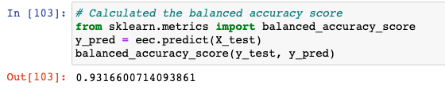
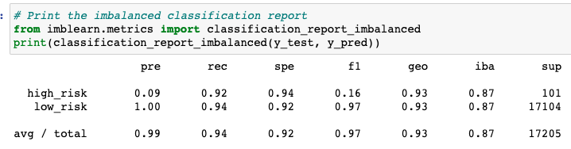
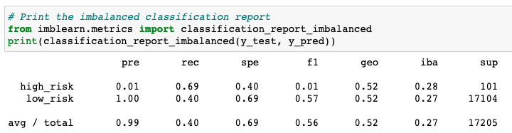

# Credit_Risk_Analysis

## Overview of the analysis

## Results: 

Below are screenshots from the balanced accuracy of all the analysis models

-   The ClusterCentroid model proved to be the least accurate at 54%

-   The EasyEnsembleClassifier model proved to be the most accurate at 93%

-   The difference between the most and least accurate was 39 points.

{width="355"}

{width="355"}

{width="355"}

{width="355"}

{width="355"}

{width="355"}

-   The balance accuracy scores were solidified by the precision and recall scores. Below we can see that while the average of the precision is the same, the recall scores are very different. The first image is from the EasyEnsembleClassifier model while the bottom image is the ClusterCentroid model.

    {width="436"}

    {width="425"}

## Summary: 

Based on the analysis conducted using the six models, the EasyEnsembleClassifier model has the highest balance accuracy score as well as the best recall at of all models. I would recommend the EasyEnsembleClassifier model of analysis for future modeling. Working with these models highlights the importance of trying different methods until you achieve consistent informative results.
